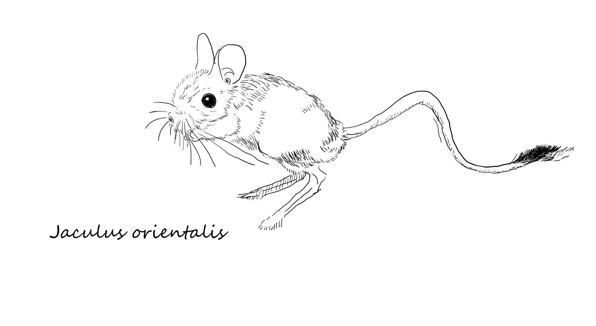

# screendrawer

Draw on the screen with Gnome and Cairo. Quick and dirty.

I needed a simple tool for drawing on the screen. The existing Gnome plugin
had some compatibility issues and anyway was not ideal for my needs. So I
wrote this simple Python script. It starts up quickly, supports pressure sensitive
drawing and has a few simple commands. Most importantly, since I am the one
who wrote it, it suits my needs perfectly.

# Features

 * Draw on the screen
 * Pressure sensitive drawing
 * Mostly single keystroke commands
 * Save the drawing as PNG
 * Change the font size
 * Change the brush size
 * Write text
 * Insert images
 * Move, group, resize, erase objects
 * Change drawing modes

Here is the 
[Greater Egyptian jerboa](https://en.wikipedia.org/wiki/Greater_Egyptian_jerboa), _Jaculus orientalis_, drawn with
screendrawer (from a photograph, not from life):



# Installation

## Dependencies

In Ubuntu, install the following packages:

```bash
sudo apt-get install python3-gi python3-gi-cairo gir1.2-gtk-3.0
```

*In theory* it should work on other systems as well, but I haven't tested
it. I tried to used platform independent libraries, but I can't guarantee
it will work.

## Install

It's just a single script.

```bash
cp sd.py ~/bin/sd
chmod a+x ~/bin/sd
```

Alternatively, get the [latest release](https://github.com/january3/screendrawer/releases/latest) as a
Debian package or a zip file.

# Usage

Run the `sd` command to start drawing on the screen

Switch between modes using single keys:

 * `d` to draw
 * `m` to move, resize, group / ungroup objects
 * `t` to write text
 * `e` to erase objects
 * `b` (box) to draw a rectangle
 * `c` (circle) to draw a circle

Other commands:

 * F1 / h / ? to show help
 * `Ctrl+Q` or `x` to quit
 * `Ctrl+S` to save the drawing as PNG
 * `Ctrl+I` to open an image
 * `Ctrl+Plus` and `Ctrl+Minus` to change the font size / line width
 * `l` or `Ctrl+L` to clear the screen
 * Ctrl+click to change the brush size (move left / right to change the size)
 * Shift+click to write a text, or change to text mode (`t`) and click to write text
 * grab an object with right mouse button to move it around, or change to
   move mode (`m`) and click to move an object
 * drag the object to the left lower corner to delete it

In `m` mode, you can move objects around, group / ungroup them (`g` and `u`
keys, respectively), resize them, or delete them.

The state is saved in / loaded from `savefile` (on Ubuntu, in the
`~/.local/share/ScreenDrawer` directory) so you can continue drawing later.

# Problems

Try to remove the savefile if you have problems.

# Design principles

 * ONE FILE. No dependencies beyond widely spread modules, no installation, no configuration
 * Transparent, sticky, not decorated window
 * Must start up and exit quickly
 * Everything that could be done with a menu must have a shortcut. The
   opposite does not need to be true.
 * This is not inkscape or illustrator, it does not have loads of features.
 * Single keystrokes and simple shortcuts are preferred
